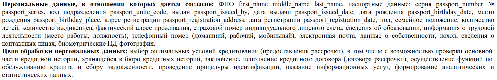
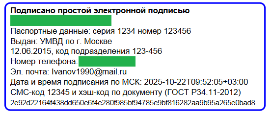
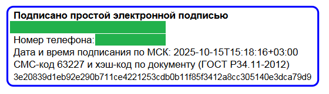

# Оглавление

- [Описание сервиса](#описание-сервиса)
- [Архитектура и компоненты](#архитектура-и-компоненты)
  - [Основные компоненты](#основные-компоненты)
  - [Основные структуры данных](#основные-структуры-данных)
  - [Методы конфигурации](#методы-конфигурации)
  - [Основные методы](#основные-методы)
  - [Работа с JSON данными](#работа-с-json-данными)
  - [Работа с логгером](#работа-с-логгером)
  - [Коды ошибок операций](#коды-ошибок-операций)
  - [Обработка ошибок](#обработка-ошибок)
- [Сборка проекта](#сборка-проекта)
  - [Инициализация сервиса в коде](#инициализация-сервиса-в-коде)
  - [Запуск](#запуск)
- [Тесты](#тесты)
- [Последние изменения](#последние-изменения)

## Описание сервиса

**SignatureService** - это сервис для электронного подписания документа соглашения простой электронной, включая генерацию PDF файла из HTML шаблона соглашения, SMS-аутентификацию, вычисления хэша методанных подписания и наложение цифрового штампа на документ.

Шаблон соглашения должен быть в формате `agreement_template.html` и содержать плейсхолдеры типа `first_name`, `passport_number`, `phone_number` и т.д., т.е. содержать поля аналогичные в переданном на вход JSON запросу. Соответственно, при подписании документа из шаблона будет сгенерирован PDF файл и все плейсхолдеры будут заменены на данные пользователя переданные в JSON запросе.



SMS-аутентификация происходит путем отправки кода подтверждения при помощи сервиса IQSMS на указанный номер телефона. Креды для сервиса указываются в `application.env`. Текст сообщения для отправки задается в `message_template.txt`, где плейсхолдер `{code}` будет заменен на переданный для отправки или сгенерированный автоматически код подтверждения.

Далее вычисляется хеш с использованием методанных PDF файла, ФИО пользователя, номера телефона, кода подтверждения и времени подписания.

На полученный PDF файл с данными пользователя накладывается цифровой штамп, содержащий все данные подписания, в том числе вычисленный хеш. При передачи входных данных, часть полей являются обязательными (ФИО, номер телефона), часть полей необязательные (паспортные данные, email), соответственно, вид штампа будет отличаться в зависимости от переданных данных.





Общая конфигурация сервиса задается в `config.ini`.

```text
# основные пути для работы
html_template_path=/home/root/bin/agreement_template.html
message_template_path=/home/root/bin/message_template.txt
env_file_path=/home/root/bin/application.env
log_file_path=/home/bin/root/log.txt
temp_dir=/home/root/bin/temp
fonts_path=
output_pdf_dir=/home/root/bin/output
# сгенерирован openssl rand -hex 16
auth_token=AUTH_TOKEN
```

## Архитектура и компоненты

### Основные компоненты:

1. **SignatureService** - основной класс подписания
2. **MessageService** - сервис отправки СМС-сообщений через IQSMS
3. **DocumentHasher** - генерация криптографических хешей
4. **HtmlTemplateProcessor** - обработка HTML шаблонов
5. **HtmlToPdfConverter** + **WkHtmlToPdfWrapper** - конвертация HTML в PDF (wkhtmltopdf)
6. **PdfStamper** - наложение цифровых штампов на PDF (PoDoFo)
7. **LoggerService** - логирование операций

### Основные структуры данных:

```cpp
/// @brief Конфигурация сервиса подписания.
struct Config {
    std::string html_template_path;     //< Путь к HTML-шаблону соглашения
    std::string message_template_path;  //< Путь к txt-шаблону сообщения
    std::string env_file_path;          //< Путь к env-файлу с log/pass для MessageService
    std::string log_file_path;          //< Путь к txt-файлу для логирования
    std::string temp_dir;               //< Директория для промежуточных файлов
    std::string fonts_dir;              //< Путь к директории со шрифтами для работы PoDoFo (не используется)
    std::string output_pdf_dir;         //< Директория для подписанных документов
    std::string auth_token;             //< Токен авторизации для проверки валидности запросов
};

/// @brief Структура содержит идентификационные данные пользователя
struct UserIdentity {
    std::string first_name;                      //< Имя пользователя
    std::string middle_name;                     //< Отчество пользователя
    std::string last_name;                       //< Фамилия пользователя
    std::string passport_number;                 //< Номер паспорта (6 цифр)
    std::string passport_series;                 //< Серия паспорта (4 цифры)
    std::string passport_issued_by;              //< Наименование органа, выдавшего паспорт
    std::string passport_issued_date;            //< Дата выдачи в формате "DD.MM.YYYY"
    std::string passport_unite_code;             //< Код подразделения в формате "XXX-XXX"
    std::string passport_birthday_date;          //< Дата рождения
    std::string passport_birthday_place;         //< Место рождения
    std::string passport_registration_address;   //< Адрес регистрации
    std::string passport_registration_date;      //< Дата регистрации
    std::string phone_number;                    //< Номер телефона в формате "+7 XXX XXX-XX-XX"
};

/// @brief Структура содержит данные электронной подписи документа
struct DocumentSignature {
    std::string confirmation_code;      //< Код подтверждения из SMS (4 цифры)
    std::string document_hash;          //< Хэш документа по ГОСТ Р34.11-2012 (64 hex символа)
    std::string signing_time;           //< Время подписания в формате "YYYY-MM-DD HH:MM:SS"
};

/// @brief Комплексная структура данных для подписания документа
struct SignerData {
    UserIdentity identity;              //< Данные пользователя для идентификации
    DocumentSignature signature;        //< Данные электронной подписи документа
};

/// @brief Структура содержит результат этапа подготовки документа к подписанию
struct DocumentPreparationResult {
    std::string temp_html_path;         //< Путь к временному HTML файлу
    std::string temp_pdf_path;          //< Путь к временному PDF файлу
};

/// @brief Структура содержит результат этапа отправки сообщения
struct MessageSendingResult {
    std::string phone_number;           //< Номер телефона, на который отправлено сообщение
    std::string message_text;           //< Текс отправленного сообщения
};

/// @brief Структура содержит результат этапа подписания документа
struct DocumentSigningResult {
    std::string first_name;             //< Имя пользователя
    std::string middle_name;            //< Отчество пользователя
    std::string last_name;              //< Фамилия пользователя
    std::string phone_number;           //< Номер телефона, использованный для подтверждения
    std::string confirmation_code;      //< Код подтверждения, введённый пользователем
    std::string signing_time;           //< Время подписания документа в формате "DD.MM.YYYY HH:MM:SS"
    std::string document_hash;          //< Криптографический хеш подписанного документа
    std::string signed_pdf_path;        //< Путь к итоговому PDF файлу с подписью
};

/// @brief Type-safe контейнер для операций, которые могут завершиться с ошибкой
template<typename T = void>
class Result {
    // Остальной код
}
```

### **Методы конфигурации**

Данные для конфигурации прописываются в файлу config.ini и подтягиваются автоматически

```text
# основные пути для работы
html_template_path=/home/root/bin/agreement_template.html
message_template_path=/home/root/bin/message_template.txt
env_file_path=/home/root/bin/application.env
log_file_path=/home/bin/root/log.txt
temp_dir=/home/root/bin/temp
fonts_path=
output_pdf_dir=/home/root/bin/output
# сгенерирован openssl rand -hex 16
auth_token=AUTH_TOKEN
```
но также можно вручную потокобезопасно задать логин/пароль для MessageService с автоматическим сохранением в application.env с помощью метода `bool setMessageServiceCreds(const std::string& login, const std::string& password)`.

Другие методы по работе с конфигурацией сервиса:
- `Config getConfig()` — потокобезопасно возвращает текущую конфигурацию сервиса;
- `void updateConfig(const Config& new_config)` — потокобезопасно обновляет конфигурацию.

### **Основные методы**

- `SignatureService(const std::string& config_path)` — создаёт сервис с указанным путем к конфигурационному файлу.
- `SignatureService(const Config& config)` — создаёт сервис с готовым объектом конфигурации.
- `Result<std::string> generateConfirmationCode(const std::string& auth_token, int length = 4)` — потокобезопасно генерирует случайный код подтверждения указанной длины с проверкой авторизации.
- `Result<DocumentSigningResult> signDocument(const std::string& auth_token, bool test_mode, bool need_all_user_data_fields, const UserIdentity& user_identity, const std::string& confirmation_code)` — потокобезопасно подписывает документ с проверкой авторизации, поддерживает тестовый режим и различные уровни проверки данных пользователя.
- `Result<ProviderSendingResult> sendMessageViaIqSms(const std::string& auth_token, bool test_mode, const std::string& phone_number, const std::string& message_text)` — отправляет SMS сообщение через провайдера IQSMS с проверкой авторизации и поддержкой тестового режима.
- `Result<bool> setMessageServiceCreds(const std::string& auth_token, const std::string& login, const std::string& password)` — потокобезопасно устанавливает новые учетные данные для SMS сервиса с сохранением в файл и проверкой авторизации.
- `Result<> updateConfig(const std::string& auth_token, const Config& new_config)` — потокобезопасно обновляет конфигурацию сервиса с проверкой авторизации.

- Методы класса `Result<T>`
  - `success()` — создать успешный результат (без значения для `void`, с данными для `T`).  
  - `error(code, message)` — создать результат с ошибкой.  
  - `isSuccess()` — проверка успешности операции.  
  - `isError()` — проверка наличия ошибки.  
  - `getValue()` — получить значение (если результат успешный).  
  - `getErrorCode()` — получить код ошибки.  
  - `getErrorMessage()` — получить сообщение об ошибке.  

### Работа с JSON данными

Для работы с JSON вида:
```json
{   
    "auth_token": "AUTH_TOKEN",
    "is_test": 1,
    "first_name": "Иван",
    "middle_name": "Иванович", 
    "last_name": "Иванов",
    "passport_number": "123456",
    "passport_series": "1234",
    "passport_issued_by": "УМВД по г. Москве",
    "passport_issued_date": "12.06.2015",
    "passport_unite_code": "123-456",
    "passport_birthday_date": "15.03.1990",
    "passport_birthday_place": "г. Москва",
    "passport_registration_address": "г. Москва, ул. Ленина, д. 1",
    "passport_registration_date": "20.06.2015",
    "email": "Ivanov1990@mail.ru",
    "phone_number": "+79123456789",
    "confirmation_code": "12345"
}
```
предназначены функции:
- `UserIdentity parsers::parseJsonStringToUserIdentity(const std::string& json_string)` - парсит JSON строку в структуру UserIdentity;
- `std::string parsers::parseUserIdentityToJsonString(const UserIdentity& user, bool pretty = true)` - парсит структуру UserIdentity в JSON строку.

### Работа с логгером

Записи в лог файле выглядят следующим образом:
```text
[2025-10-14T12:29:02+03:00] [INFO] [Thread:132746208360384] SignatureService: logger was started
[2025-10-14T12:29:02+03:00] [INFO] [Thread:132746208360384] SignatureService: preparing document for signing
[2025-10-14T12:29:02+03:00] [INFO] [Thread:132746208360384] SignatureService: document prepared successfully
[2025-10-14T12:29:03+03:00] [INFO] [Thread:132746208360384] SignatureService: sending SMS to: +79*********
[2025-10-14T12:29:03+03:00] [INFO] [Thread:132746208360384] SignatureService: Responcse from IQSMS: accepted;6776285131
[2025-10-14T12:29:04+03:00] [INFO] [Thread:132746208360384] SignatureService: SMS status from IQSMS: 6776285131;queued
[2025-10-14T12:29:04+03:00] [INFO] [Thread:132746208360384] SignatureService: creating PDF stamp
[2025-10-14T12:29:04+03:00] [SUCCESS] [Thread:132746208360384] SignatureService: document signed successfully for: +79*********
```
Методы `LoggerService`, использующиеся для логирования:
```cpp
/// @brief Записать информационное сообщение
void logInfo(const std::string& message);

/// @brief Записать предупреждение
void logWarning(const std::string& message);

/// @brief Записать сообщение об ошибке
void logError(const std::string& message);

/// @brief Записать сообщение об успехе
void logSuccess(const std::string& message);
```

### Коды ошибок операций:

```cpp
/// @brief Коды ошибок операций сервиса
enum class ErrorCode {
    SUCCESS,                            //< Операция выполнена успешно
    INIT_SERVICE_ERROR,                 //< Ошибка инициализации сервиса
    INVALID_USER_DATA,                  //< Отсутствуют обязательные поля в USER DATA
    INVALID_JSON,                       //< Невалидный JSON формат
    INVALID_AUTH_TOKEN,                 //< Невалидный токен авторизации
    FILE_IO_ERROR,                      //< Ошибка чтения/записи файла
    HTML_REPLACE_ERROR,                 //< Ошибка замены плейсхолдеров в HTML шаблоне
    PDF_GENERATION_ERROR,               //< Ошибка генерации PDF из HTML шаблона
    SMS_SEND_ERROR,                     //< Ошибка отправки SMS сообщения
    AUTHENTICATION_FAILED,              //< Неверный код подтверждения или ошибка аутентификации
    STAMP_APPLICATION_ERROR,            //< Ошибка наложения штампа на документ
    INVALID_CONFIG,                     //< Невалидная конфигурация сервиса
    CREDENTIALS_ERROR,                  //< Невалидная конфигурация сервиса MessageService
    SERVICE_SHUTDOWN,                   //< Сервис остановлен и не принимает новые задачи
    UNKNOWN_ERROR                       //< Неизвестная ошибка
};
```

### Обработка бработки ошибок:

```cpp
auto result = service.signDocument(...);

if (!result.IsSuccess()) {
    switch (result.error_code) {
        case SignatureService::ErrorCode::INVALID_JSON:
            // Обработка ошибки JSON
            break;
        case SignatureService::ErrorCode::SMS_SEND_ERROR:
            // Обработка ошибки SMS
            break;
        // ... другие коды ошибок
        default:
            // Обработка неизвестной ошибки
    }
}
```

## **Сборка проекта**

```bash
# Первая настройка
cmake -B build -DCMAKE_BUILD_TYPE=Release

# Сборка (основная команда)
cmake --build build --parallel

# Только пересборка изменений
cmake --build build --parallel

# Очистка и полная пересборка
cmake --build build --clean-first --parallel
```

Скопировать содержимое директории `resoures` в `bin`

### Инициализация сервиса в коде
```cpp
auto& converter = WkHtmlToPdfWrapper::getInstance(); // <- создание конвертора
if (!converter.initialize()) {         // <- обязательная инициализация конвертора в главном потоке
    std::cerr << "Failed to initialize PDF converter" << std::endl;
}
SignatureService signer(config_file);

// Остальной код ...

converter.shutdown(true);             // <- обязательная деинициализация конвертора в том же потоке
```

### **Запуск**
```bash
./DocumentSigner ./config.ini ./data.json
```

## Тесты

Тест 8 потоков по 50 операций 

```bash
user@DESKTOP-GL364V5:~/cpp_files/document_signer_ver_1.3/bin $ ./DocumentSigner 
Running large-scale concurrency tests...
=== 🚀 Starting Large-Scale Concurrency Tests ===
Testing with 400 operations across multiple threads...

--- 📝 Test 1: Full Signing Cycle (400 operations) ---
✓ Thread 2: 10 successful operations
✓ Thread 3: 20 successful operations
✓ Thread 6: 30 successful operations
✓ Thread 7: 40 successful operations
✓ Thread 2: 50 successful operations
✓ Thread 3: 60 successful operations
✓ Thread 6: 70 successful operations
✓ Thread 7: 80 successful operations
✓ Thread 2: 90 successful operations
✓ Thread 3: 100 successful operations
✓ Thread 6: 110 successful operations
✓ Thread 7: 120 successful operations
✓ Thread 2: 130 successful operations
✓ Thread 3: 140 successful operations
✓ Thread 6: 150 successful operations
✓ Thread 7: 160 successful operations
✓ Thread 2: 170 successful operations
✓ Thread 3: 180 successful operations
✓ Thread 6: 190 successful operations
✓ Thread 7: 200 successful operations
✓ Thread 2: 210 successful operations
✓ Thread 3: 220 successful operations
✓ Thread 6: 230 successful operations
✓ Thread 7: 240 successful operations
✓ Thread 2: 250 successful operations
✓ Thread 3: 260 successful operations
✓ Thread 6: 270 successful operations
✓ Thread 7: 280 successful operations
✓ Thread 2: 290 successful operations
✓ Thread 3: 300 successful operations
✓ Thread 6: 310 successful operations
✓ Thread 7: 320 successful operations
✓ Thread 2: 330 successful operations
✓ Thread 3: 340 successful operations
✓ Thread 6: 350 successful operations
✓ Thread 7: 360 successful operations
✓ Thread 2: 370 successful operations
✓ Thread 3: 380 successful operations
✓ Thread 6: 390 successful operations
✓ Thread 7: 400 successful operations

=== 📊 Test Results ===
Total time: 143886 ms
Total operations: 400
Successful: 400
Failed: 0
Exceptions: 0
Success rate: 100.00%
Operations per second: 2.78

✅ SUCCESS: All tests passed successfully!

=== 🎯 Concurrency Testing Complete ===
```

## **Последние изменения**

### **Переработаны основные методы подписания в SignatureService**

- Добавлены тестовый режим подписания, при котором не происходит отправка СМС-сообщения.
- Добавлен токен валидации запросов, функция проверки токена валидации, поле auth_token в файле конфигурации.
- Добавлены функции валидации для структур UserIdentity, которые содержат полную или краткную информацию о пользователей.
- Добавлена проверка статуса отправленного сообщения.

### **Добавлены новые структуры в MessageService**

- Добавлена структура `ProviderSendingResult` - результат запроса отправки сообщения.
- Добавлена структура `ProviderBalanceResult` - результат запроса проверки баланса.
- Добавлен метод проверки статуса отправленного сообщения.

### **Добавлена поддержка многопоточности в SignatureService**

1. Методы класса `SignatureService` теперь потокобезопасны:
    - Используется `std::mutex` для защиты конфигурации и доступа к подсервисам.
    - Можно безопасно совершать полный цикл подписания документа `prepareDocumentForSigning()`->`generateCodeAndSendMessage()`->`signDocument()` из нескольких потоков одновременно.

2. Добавлен новый класс `WkHtmlToPdfWrapper` - singleton-класс-обёртка для работы с библиотекой wkhtmltopdf в потокобезопасном режиме, поскольку библиотека не поддерживает многопоточность даже с синхронизацией, то есть все вызовы конвертации HTML → PDF должны выполняться в одном потоке.
`WkHtmlToPdfWrapper` решает эту проблему, предоставляя:
- Один рабочий поток для всех конвертаций
- Очередь задач, куда могут добавлять задачи несколько потоков одновременно
- Поддержку синхронного и асинхронного API

### **Выделение работы с файлами**

- Функции по работе с временными файлами вынесены из `SignatureService` в отдельный namespace `file_utils`.
- Добавлены функции:
    - `createTempCopyWithUniqueFilename()` — создаёт временную копию файла с уникальным именем.
    - `generateUniqueFilename()` — генерирует уникальные имена с учётом времени, потока, счётчика и случайного числа.
    - `cleanupTempFiles()` — безопасное удаление временных файлов.
    - `fileExists()` и `ensureDirectoryExists()` — проверки и создание директорий.
        
- Все функции потокобезопасны, используют мьютекс для синхронизации файловой системы.

### **Замена TimeUtils**

- Класс `TimeUtils` заменён на namespace `time_utils` для упрощения работы с временем и синтаксиса.

### **Прочие улучшения**

- Убраны прямые зависимости на файловую систему из `SignatureService`, директории `temp` и `output` создаются автоматически при вызове конструктора класс.